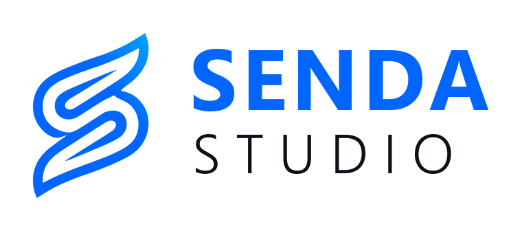

<p align="center">
  <picture>
    <source media="(prefers-color-scheme: dark)" srcset="docs/marca/logo-oscuro.png">
    
  </picture>
</p>

# Senda Studio

**Estudio de emisión en directo para Android, libre y de código abierto.**
Escenas, fuentes, mezclador de audio y emisión a varias plataformas a la vez: un estudio completo,
pensado desde cero para el móvil.

[](https://github.com/lopezdevf/senda-studio/actions/workflows/android.yml)
[](#licencia)
[](https://github.com/sponsors/lopezdevf)

> **Estado:** alfa. Todo el flujo (compositor OpenGL, captura, codificación, emisión, grabación, audio y
> control térmico) está implementado y probado en un Galaxy S25 Ultra: cámaras trasera y frontal,
> grabación, emisión a Twitch en 1080p60, mezclador y la fuente PC con Senda Studio PC por WiFi. **Aún falta
> probarlo en más móviles**; si lo pruebas, cuéntanos cómo va en *issues*.

## Descargar

| | Enlace | Requisitos |
|---|---|---|
| **Senda Studio** (móvil) | [SendaStudio.apk](https://github.com/lopezdevf/senda-studio/releases/latest/download/SendaStudio.apk) | Android 10 o posterior |
| **Senda Studio PC** (opcional) | [SendaStudioPC.exe](https://github.com/lopezdevf/senda-studio/releases/latest/download/SendaStudioPC.exe) | Windows 10 (1903) u 11, 64 bits |

Todas las versiones y sus notas: [Releases](https://github.com/lopezdevf/senda-studio/releases).

- **Android:** al abrir el APK, permite «Instalar apps desconocidas» para el navegador o el gestor de archivos.
- **Windows:** el programa aún no está firmado con un certificado de pago, así que SmartScreen puede avisar la
  primera vez: «Más información» → «Ejecutar de todas formas». No hace falta instalarlo.

## Características

| Área | Qué incluye |
|------|-------------|
| **Escenas** | Escenas ilimitadas, capas con orden, bloqueo y visibilidad, modo estudio (previo + programa) con transición |
| **Fuentes** | Cámaras del móvil, cámaras USB y capturadoras HDMI (UVC), pantalla, imagen, texto y color |
| **Audio** | Mezclador con ganancia en dB, balance y silencio; micrófonos integrados, con cable, USB o Bluetooth; audio interno de juegos; monitorización por audífonos |
| **Emisión** | Twitch, YouTube, Kick, TikTok, Facebook, Instagram, X, Trovo, Restream, LinkedIn, Rumble, Steam, Vimeo, RTMP y SRT personalizados, **varias a la vez** |
| **Calor** | Control térmico que baja bitrate, fps o resolución por pasos antes de que el sistema estrangule el procesador, y recupera calidad al enfriarse |
| **Privacidad** | Claves de emisión cifradas con Android Keystore; sin analíticas ni cuentas |

### Conectar una plataforma

Pestaña **DESTINOS** → **+** → pega el enlace de conexión (`rtmp://…`, `rtmps://…` o `srt://…`) o elige
la plataforma. Senda Studio detecta de qué servicio es, separa servidor y clave y avisa si el servidor no
pertenece a la plataforma elegida. También puedes *compartir* el enlace con la app desde otra aplicación.

### Jugar en el PC y emitir desde el móvil

Sin capturadora ni programas de terceros: **Senda Studio PC**, una aplicación propia para Windows de 370 KB, envía la pantalla y
el sonido del ordenador al móvil por WiFi o por cable USB, y Senda Studio los mezcla con tu cámara y hace el
directo. Encuentra el móvil sola en la red, se empareja con un código de 4 cifras y codifica por hardware
en modo de baja latencia (unos 28 ms medidos por WiFi). Guía en [docs/PC.md](docs/PC.md).

### Protección contra el sobrecalentamiento

Senda Studio combina el estado térmico del sistema, el margen previsto (`getThermalHeadroom`) y la temperatura
de la batería:

| Nivel | Acción automática |
|-------|-------------------|
| Leve | −10 % bitrate, vista previa a 24 fps |
| Moderado | −25 % bitrate, máximo 30 fps, vista previa a 15 fps, un solo render en modo estudio |
| Severo | −45 % bitrate, fps mínimos, resolución al 75 % |
| Crítico | −60 % bitrate, resolución al 50 %, vista previa a 5 fps |
| Emergencia | Detiene el directo y guarda la grabación antes de que el sistema cierre la app |

Sube de nivel al instante y baja de uno en uno tras 90 s más frío, para no oscilar. Todo es
configurable: suelos de fps y bitrate, límite de batería, modo *solo avisar* o desactivado.

## Compilar

Requisitos: Android Studio Quail 4 (2026.1.4) o superior, JDK 17+, SDK de Android 37.

```bash
git clone https://github.com/lopezdevf/senda-studio.git
cd senda-studio
./gradlew assembleDebug
```

Tests del motor:

```bash
./gradlew :engine:testDebugUnitTest
```

Versión firmada para publicar: `./gradlew assembleRelease` firma con la clave de
`~/.sendastudio/firma.properties` (`storeFile`, `storePassword`, `keyAlias`, `keyPassword`) o la ruta de la
variable `SENDA_SIGNING`; sin ese archivo, el APK release sale sin firmar.

Senda Studio PC (Windows, C++ con el SDK de Windows): `pc\build.cmd`. Más en [docs/PC.md](docs/PC.md).

Estructura: `engine/` (modelo, salida, audio, térmica; sin UI), `app/` (Jetpack Compose) y `pc/`
(Senda Studio PC). La arquitectura está explicada en [docs/ARQUITECTURA.md](docs/ARQUITECTURA.md).

## Hoja de ruta

- [x] Mesa de control: escenas, capas, lienzo editable con gestos, modo estudio con fundido
- [x] Destinos: 15 plataformas, enlaces de conexión, claves cifradas, multistream, prueba de conexión
- [x] Compositor OpenGL: cámaras (incluidas externas), cámaras USB/capturadoras UVC, pantalla, imagen y texto
- [x] Codificación por hardware H.264/H.265 (VBR o CBR), emisión RTMP/SRT, grabación MP4 y bitrate adaptativo
- [x] Fuente PC y Senda Studio PC (Windows): pantalla y sonido del ordenador por WiFi o cable USB, sin capturadora
- [x] Audio por dispositivo (integrado, cable, USB, Bluetooth), audio interno, mezclador y monitorización
- [x] Control térmico real (estado del sistema, margen previsto y batería)
- [x] Ajustes completos, propiedades de cada fuente y escenas guardadas entre sesiones
- [ ] Pruebas en una variedad de móviles y ajuste de la rotación de cámaras por fabricante
- [ ] Filtros (chroma key, LUT), overlay de chat y alertas
- [ ] Inicio de sesión con cuenta por plataforma (OAuth)

## Identidad visual

La «S» de Senda Studio es una senda: dos líneas de flujo que llevan la señal desde el origen (la cámara, el
PC) hasta el público, y que se entrelazan como las contribuciones de una comunidad abierta.

| Color | Uso |
|---|---|
| Azul eléctrico `#0066FF` | Color principal: isotipo, «SENDA» y lo activo en la app |
| Blanco `#FFFFFF` | Textos, «STUDIO» y el isotipo en un color |
| Cian neón `#00A3FF` | Brillos y acentos finos |
| Azul noche `#0D1117` | Fondo |

Isotipo en SVG (color, azul y blanco), logotipo e icono de la app en [docs/marca](docs/marca).

## Apoyar el proyecto

Senda Studio es gratis y sin anuncios. Si te resulta útil, puedes apoyar su desarrollo desde
[GitHub Sponsors](https://github.com/sponsors/lopezdevf). También ayuda muchísimo reportar errores,
traducir o enviar mejoras: lee [CONTRIBUTING.md](CONTRIBUTING.md).

## Licencia

Senda Studio es software libre: puedes redistribuirlo y modificarlo bajo los términos de la
**GNU General Public License, versión 2 o (a tu elección) cualquier versión posterior**
(`GPL-2.0-or-later`). Consulta [LICENSE](LICENSE) (GPLv2) y [LICENSE-GPL-3.0.txt](LICENSE-GPL-3.0.txt) (GPLv3).

Las dependencias bajo Apache 2.0 (AndroidX, RootEncoder…) solo son compatibles con la GPLv3, por lo que
**los APK compilados se distribuyen bajo GPLv3**. El detalle está en [NOTICE.md](NOTICE.md).

Este programa se distribuye con la esperanza de que sea útil, pero **sin ninguna garantía**.

---

*English:* Senda Studio is a free and open-source live streaming studio for Android: scenes,
sources, audio mixer, multistreaming to any RTMP/SRT platform and thermal protection.
Licensed under GPL-2.0-or-later.
