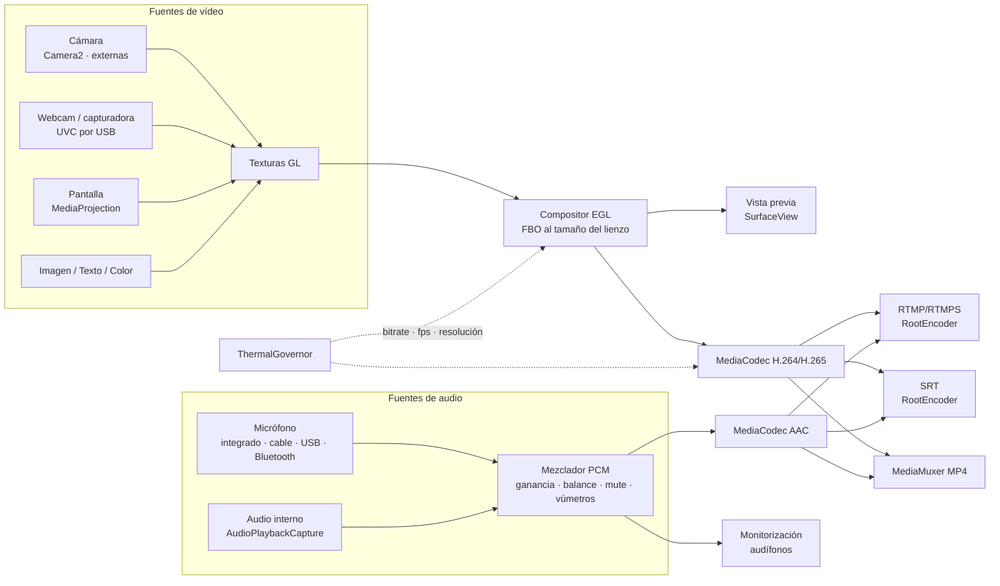
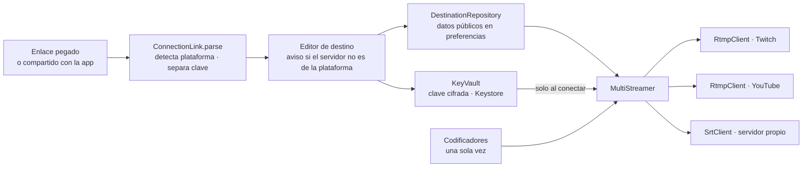

# Nexo Live — Arquitectura

Estudio de emisión móvil al estilo OBS: escenas compuestas por fuentes, mezclador de audio,
emisión RTMP/SRT y grabación local. Android primero, en Kotlin.

## Módulos

| Módulo    | Contenido |
|-----------|-----------|
| `:engine` | Modelo, `StudioEngine`, compositor GL, capturas, audio, codificadores, destinos, grabación, térmica y servicio en primer plano. Sin Compose. |
| `:app`    | UI en Jetpack Compose (mesa de control, propiedades, ajustes), tema Nexo, ViewModels. |

Paquetes de `:engine`: `model`, `studio` (estado y guardado), `render` + `gl` (compositor), `capture`
(Camera2, UVC, pantalla), `audio`, `encode`, `output` (destinos, multistream, MP4), `devices`, `thermal`,
`settings` y `service`.

## Flujo de datos

`StudioController` es la única fuente de verdad (`StateFlow<StudioState>`). La UI llama a sus
operaciones y el compositor y las salidas observan el mismo estado, así que editar la escena
en pantalla cambia lo que sale al aire sin capas intermedias.

## Decisiones

- **Coordenadas normalizadas (0..1)** en `Transform`: una escena funciona igual en 720p, 1080p o vertical.
- **Fuentes globales** referenciadas por `SceneItem`: la misma cámara en varias escenas no se abre dos veces.
- **Modo estudio**: previo editable + programa al aire, con transición entre ambos.
- **minSdk 29**: el audio interno (AudioPlaybackCapture) está disponible siempre.
- **Compositor propio + RootEncoder solo para protocolos**: controlamos el render de escenas y
  delegamos RTMP/SRT a una librería probada (Apache 2.0).
- **Claves de retransmisión fuera del modelo**: `StreamDestination` no contiene la clave; `KeyVault`
  la cifra con AES-GCM y una llave de Android Keystore.
- **Entrada por superficie**: el compositor dibuja directamente en la superficie de MediaCodec; no hay
  copias de píxeles por CPU, que es lo que más calienta en apps de streaming.
- **Solo se abre lo que se ve**: el compositor crea las capturas de las escenas visibles y cierra las que
  llevan 5 s sin usarse, o todas si nadie mira la vista previa y no se emite.
- **Temporizador propio en lugar de vsync**: con la pantalla apagada no hay vsync y el directo debe seguir.
- **Un codificador para emitir y grabar**: la grabación reutiliza el vídeo codificado del directo.
- **Reloj de audio propio**: el mezclador saca un bloque AAC (1024 muestras) exactamente cada 21,3 ms
  y cada fuente llena su búfer circular; si una fuente se retrasa suena silencio en vez de desincronizar.

## Protección térmica

`ThermalMonitor` combina el aviso del sistema (`PowerManager`), el margen previsto
(`getThermalHeadroom`, Android 11+) y la temperatura de la batería. `ThermalGovernor` (lógica pura con
tests) decide el perfil: sube de nivel al instante y baja de uno en uno tras `recoverySeconds` más
frío. `StudioEngine` aplica el perfil al bitrate del codificador, a los fps de salida y vista previa,
a la escala del lienzo y al render doble del modo estudio; en emergencia detiene el directo y cierra la
grabación antes de que Android mate la app.

## Dispositivos

`DeviceCatalog` enumera cámaras Camera2 (frontal, trasera, externa), cámaras UVC por USB, entradas y
salidas de audio, y se actualiza al conectar o desconectar. Los dispositivos de audio se guardan por
tipo, nombre y dirección (`AudioDeviceKey`) porque Android cambia su id en cada conexión. Los
micrófonos Bluetooth usan el modo de llamada (calidad limitada, la UI lo avisa) y la monitorización
prefiere audífonos con cable por latencia.

## Destinos y multistream

Todas las plataformas se conectan por **enlace de conexión** (servidor + clave RTMP/RTMPS/SRT). Es el
único método universal: no depende de APIs ni de aprobaciones de cada plataforma, y sirve para
cualquier servicio compatible aunque no esté en el catálogo.

- **`PlatformCatalog`**: 15 destinos (Twitch, YouTube, Kick, TikTok, Facebook, Instagram, X, Trovo,
  Restream, LinkedIn, Rumble, Steam, Vimeo, RTMP y SRT personalizados). Servidores y límites de bitrate
  contrastados con la lista de servicios de OBS y la API de ingest de Twitch.
- **`ConnectionLink`**: RootEncoder toma los dos primeros segmentos de la ruta como «app», así que la
  clave va siempre al final y el servidor no admite «?». Los servidores de Amazon IVS (Twitch, Kick)
  se normalizan a `/app`.
- **`MultiStreamer`**: se codifica una vez y cada destino recibe su copia (`ByteBuffer.duplicate`) por su
  propia conexión, con reintentos independientes (2 s, 4 s, 8 s…). Basta un destino al aire para que
  la franja muestre «EN DIRECTO». «Probar conexión» conecta y desconecta sin enviar vídeo y nunca cuenta
  como emisión.
- **Subida**: el ancho de banda necesario es la suma de todos los destinos activos; la pestaña lo muestra.
- **Enlaces entrantes**: la app abre `rtmp://`, `rtmps://` y `srt://` y acepta texto compartido, pero
  solo rellena el editor; nunca guarda ni emite sin confirmación.

**Inicio de sesión con cuenta (OAuth)**, para crear el directo y obtener la clave automáticamente, es un
añadido posterior. Exige registrar una app de desarrollador en cada plataforma y pasar sus revisiones
(YouTube Data API, Twitch, Meta), y TikTok e Instagram no ofrecen esa vía a terceros de forma general.

## Hoja de ruta

1. **Esqueleto** ✅ — proyecto Gradle, modelo del estudio con tests y mesa de control en Compose
   (lienzo editable con gestos e imanes, escenas, capas, mezclador y modo estudio).
2. **Destinos** ✅ — catálogo de plataformas, enlaces de conexión, claves cifradas, multistream y prueba de conexión.
3. **Compositor GL** ✅ — hilo de render EGL, cámaras, UVC, pantalla, color, texto e imagen, fundidos y vista previa real.
4. **Salida** ✅ — codificadores MediaCodec conectados a `MultiStreamer`, grabación MP4, servicio en primer plano y
   bitrate adaptativo.
5. **Audio y dispositivos** ✅ — captura por dispositivo, audio interno, mezclador, vúmetros y monitorización.
6. **Térmica, ajustes y guardado** ✅ — protección térmica real, ajustes completos y escenas persistentes.
7. **Validación en dispositivos** — pruebas en varios fabricantes (rotación de cámaras, codificadores, UVC).
8. **Extras** — inicio de sesión OAuth por plataforma, chroma key/LUT, overlay de chat y alertas.
